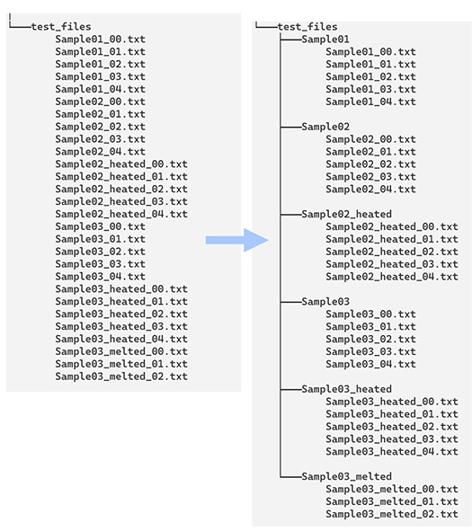
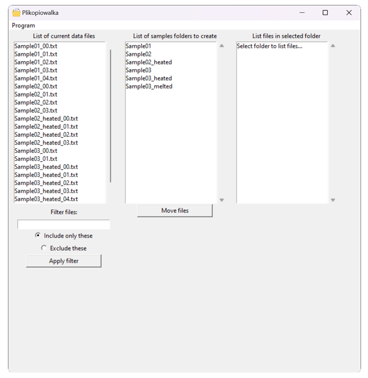
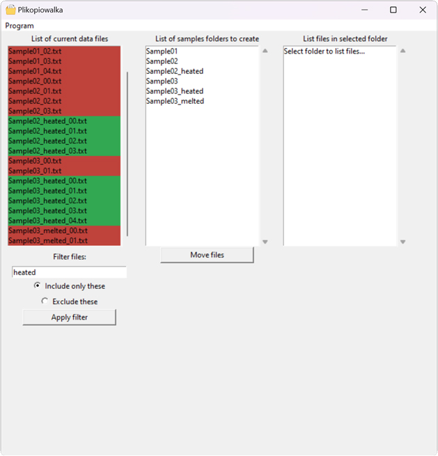

# File sorter GUI program
This is a simple program to sort files into separate directories based on the name. It was created to handle mainly measurement files like electron microscope (TEM/SEM) images, that needs to be sorted based on the sample name. Doing this manually can get tedious when the number of samples measured within one measurement session is high. The program creates a directory for each sample and moves all files of each sample to a corresponding directory. It is assumed that each sample has a unique name, like Sample01 or Sample02 and each consecutive measurement (like microscope image) is named by adding a numeric postfix, for example Sample01_01.png, Sample01_02.png etc. 

To use the program, select folder where the measurements reside (by using Program -> Open). The left column contain list of raw files. Folders, which will be created are listed in the middle column. You can click on any entry here and a list of files which will be moved to that particular folder will be displayed in the right column. To perform moving operation, click 'Move files' button.

You can also apply filter to select files with particular name. For example, to select only files with 'heated' in the name, write 'heated', select 'Include only these'. Selected files will be colored in green, while those to be removed from the list will be red. Click apply filter to filter the file list.

The app is written in Python and uses tkinter to create GUI for easy and intuitive usage. 